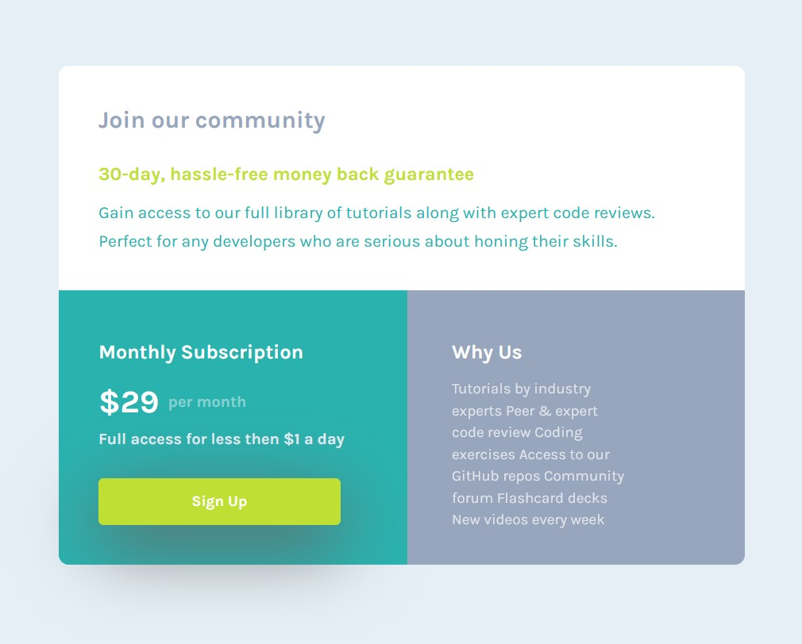

# Frontend Mentor - Single price grid component solution

## Table of contents

- [Overview](#overview)
  - [The challenge](#the-challenge)
  - [Screenshot](#screenshot)
- [My process](#my-process)
  - [Built with](#built-with)
  - [What I learned](#what-i-learned)
  - [Continued development](#continued-development)
- [Author](#author)

## Overview

### The challenge

-  multiple paragraph lines with differnet.
-  organising all the container and paragraphs.

### Screenshot

## My process

### Built with

- Semantic HTML5 markup
- CSS custom properties
- Flexbox

### What I learned

learn about media query alingnment of container using flexbox 

### Continued development

continue learn about grid and use in project to develop more optimize web page

## Author

- Website - [Gourav Rattan](https://www.your-site.com)

